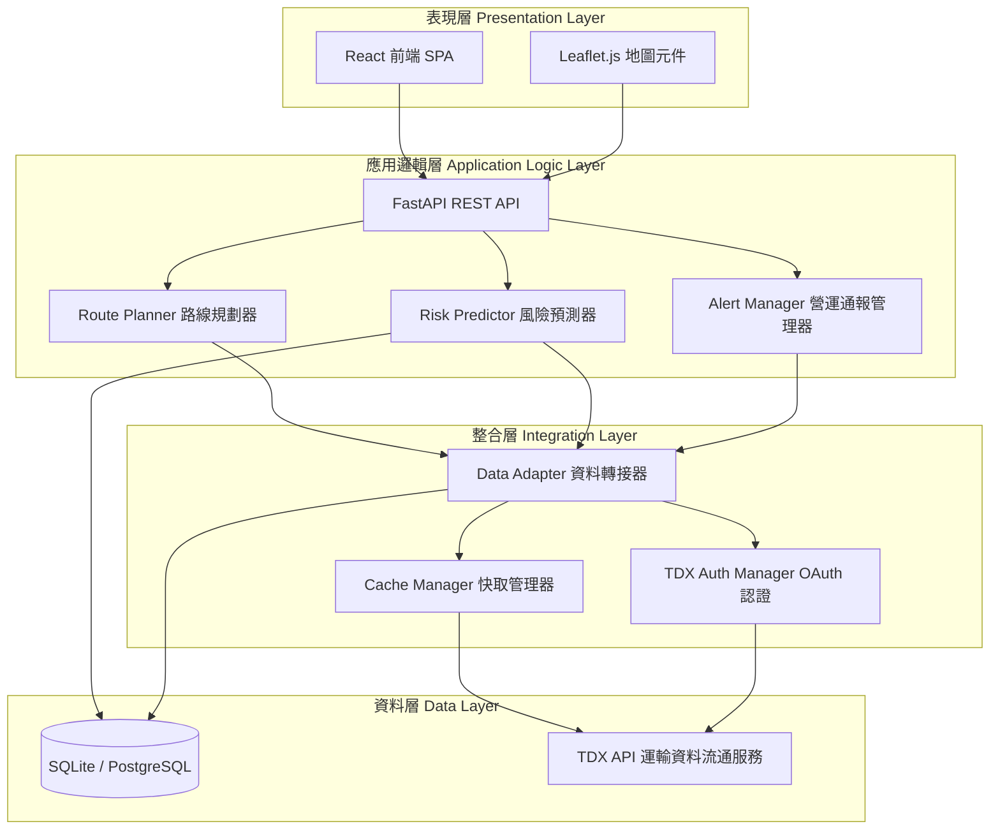
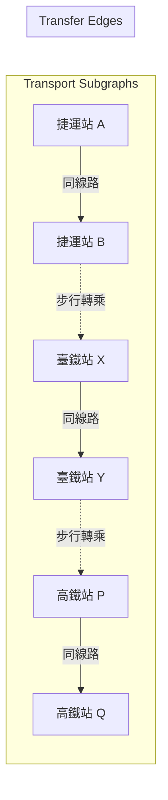
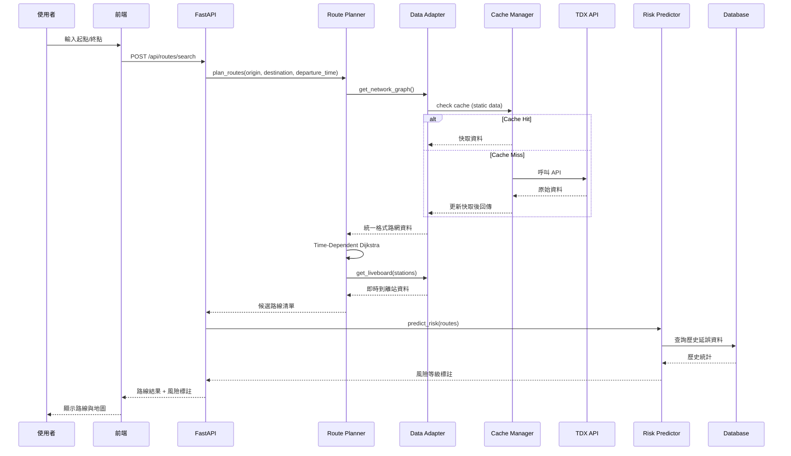
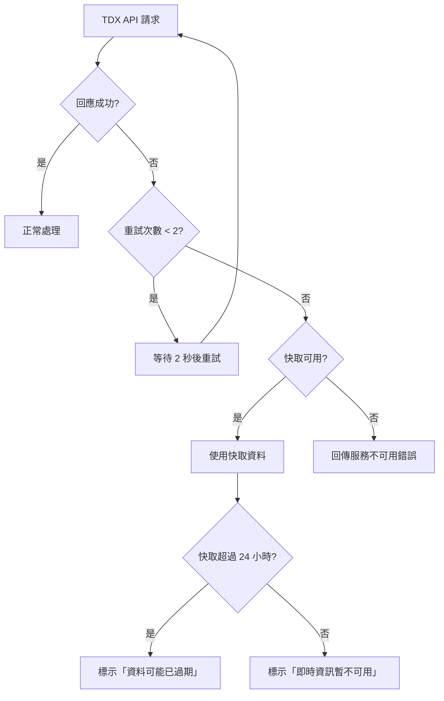

# 技術設計文件：跨運具轉乘資訊整合查詢平台

## 概述 (Overview)

本設計文件描述跨運具轉乘資訊整合查詢平台之技術架構與實作方案。平台採用四層式架構（資料層 → 整合層 → 應用邏輯層 → 表現層），以 Python FastAPI 為後端核心，整合台灣 TDX 運輸資料流通服務平台 API，提供跨運具路線規劃、即時動態整合與轉乘風險預測功能。

### 設計目標

- 透過 Adapter Pattern 統一五種運具（桃園捷運、臺中捷運、高雄捷運、臺鐵、高鐵）之資料格式
- 以圖論演算法（Time-Dependent Dijkstra）實現多模態路線規劃
- 整合即時到離站資訊與營運通報，動態調整路線建議
- 運用機器學習模型預測轉乘延誤風險
- 支援地圖視覺化呈現與響應式前端介面

### 技術選型摘要

| 層級 | 技術 | 說明 |
|------|------|------|
| 後端框架 | FastAPI (Python 3.11+) | 非同步高效能 REST API |
| 資料庫 | SQLite (原型) / PostgreSQL (正式) | 站點、路網、歷史延誤資料 |
| 資料處理 | Pandas | 班表解析與統計分析 |
| 快取 | Redis (正式) / 記憶體快取 (原型) | API 回應快取 |
| 前端 | React + TypeScript | SPA 架構 |
| 地圖 | Leaflet.js | 路線視覺化 |
| 預測模型 | scikit-learn / XGBoost | 延誤風險分類 |
| 即時資料 | 輪詢 (Polling) | 每 60 秒更新 LiveBoard |
| 部署 | Railway / Render | 雲端部署 |

## 架構 (Architecture)

### 系統架構圖



### 路線規劃圖模型



### 請求處理流程



## 元件與介面 (Components and Interfaces)

### 1. 資料轉接器 (Data Adapter)

採用 Adapter Pattern，每種運具實作獨立的轉接器，共用統一介面。

```python
from abc import ABC, abstractmethod
from typing import List, Optional
from datetime import datetime

class BaseTransportAdapter(ABC):
    """所有運具轉接器之抽象基底類別"""

    @abstractmethod
    async def get_stations(self) -> List["Station"]:
        """取得該運具所有站點資料"""
        ...

    @abstractmethod
    async def get_routes(self) -> List["Route"]:
        """取得該運具所有路線/路網結構"""
        ...

    @abstractmethod
    async def get_timetable(self, station_id: str, date: datetime) -> List["TimetableEntry"]:
        """取得特定站點之班表"""
        ...

    @abstractmethod
    async def get_liveboard(self, station_id: str) -> List["LiveBoardEntry"]:
        """取得特定站點之即時到離站資訊"""
        ...

    @abstractmethod
    async def get_alerts(self) -> List["ServiceAlert"]:
        """取得營運通報"""
        ...


class MetroAdapter(BaseTransportAdapter):
    """捷運轉接器（桃園/臺中/高雄共用，透過 system_id 區分）"""

    def __init__(self, system_id: str, tdx_client: "TDXClient"):
        self.system_id = system_id  # "TYM", "KRTC", "TMRT"
        self.tdx_client = tdx_client


class TRAAdapter(BaseTransportAdapter):
    """臺鐵轉接器"""
    ...


class THSRAdapter(BaseTransportAdapter):
    """高鐵轉接器"""
    ...


class AviationAdapter(BaseTransportAdapter):
    """航空轉接器"""
    ...


class FerryAdapter(BaseTransportAdapter):
    """渡輪轉接器"""
    ...
```

### 2. TDX API 客戶端

```python
class TDXClient:
    """TDX API 統一存取客戶端，處理 OAuth 認證與錯誤重試"""

    BASE_URL = "https://tdx.transportdata.tw/api/basic"
    AUTH_URL = "https://tdx.transportdata.tw/auth/realms/TDXConnect/protocol/openid-connect/token"

    def __init__(self, client_id: str, client_secret: str):
        self.client_id = client_id
        self.client_secret = client_secret
        self._token: Optional[str] = None
        self._token_expires: Optional[datetime] = None

    async def authenticate(self) -> str:
        """取得或刷新 OAuth access token"""
        ...

    async def request(
        self,
        endpoint: str,
        params: Optional[dict] = None,
        max_retries: int = 2,
        retry_interval: float = 2.0,
        timeout: float = 10.0,
    ) -> dict:
        """
        發送 API 請求，含重試邏輯。
        - 逾時 10 秒觸發重試
        - 最多重試 2 次，間隔 2 秒
        - 失敗後記錄錯誤並拋出 TDXAPIError
        """
        ...
```

### 3. 快取管理器 (Cache Manager)

```python
from enum import Enum

class CachePolicy(Enum):
    STATIC = "static"    # TTL: 24 小時（站點、路網、班表）
    REALTIME = "realtime"  # TTL: 30 秒（LiveBoard）
    ALERT = "alert"      # TTL: 10 分鐘（營運通報）


class CacheManager:
    """快取管理器，支援不同 TTL 策略"""

    def __init__(self, backend: "CacheBackend"):
        self.backend = backend
        self._ttl_map = {
            CachePolicy.STATIC: 86400,    # 24 hours
            CachePolicy.REALTIME: 30,     # 30 seconds
            CachePolicy.ALERT: 600,       # 10 minutes
        }

    async def get(self, key: str, policy: CachePolicy) -> Optional[Any]:
        """取得快取資料，若過期回傳 None"""
        ...

    async def set(self, key: str, value: Any, policy: CachePolicy) -> None:
        """設定快取資料"""
        ...

    async def invalidate(self, key: str) -> None:
        """手動失效特定快取"""
        ...
```

### 4. 路線規劃器 (Route Planner)

```python
import heapq
from dataclasses import dataclass
from typing import List, Tuple

@dataclass
class GraphNode:
    """圖節點：代表一個站點"""
    station_id: str
    transport_mode: str  # "metro", "tra", "thsr", "aviation", "ferry"

@dataclass
class GraphEdge:
    """圖邊：代表一段行程或轉乘"""
    source: GraphNode
    target: GraphNode
    edge_type: str  # "route" 或 "transfer"
    travel_time_fn: callable  # time-dependent: f(departure_time) -> minutes
    trip_id: Optional[str] = None  # 車次/班次編號

@dataclass
class RoutePlan:
    """一條完整的路線規劃結果"""
    segments: List["RouteSegment"]
    total_time: int  # 總行程時間（分鐘）
    transfer_count: int
    risk_levels: Optional[List["ConnectionRisk"]] = None


class RoutePlanner:
    """路線規劃核心引擎"""

    def __init__(self, graph: "TransportGraph", liveboard_service: "LiveBoardService"):
        self.graph = graph
        self.liveboard = liveboard_service

    async def plan_routes(
        self,
        origin: str,
        destination: str,
        departure_time: datetime,
        max_results: int = 5,
        max_transfers: int = 4,
    ) -> List[RoutePlan]:
        """
        規劃跨運具路線。
        演算法：Time-Dependent Dijkstra with transfer penalties
        
        步驟：
        1. 以起點站為源點，建立優先佇列
        2. 對每個節點，考慮同運具路段邊與跨運具轉乘邊
        3. 轉乘邊權重 = 步行時間 + Buffer_Time + 候車時間
        4. 收集到達終點之 top-K 路線（K = max_results）
        5. 依總行程時間排序
        6. 確保至少一條路線包含兩種以上運具
        """
        ...

    def _build_time_dependent_graph(self, departure_time: datetime) -> "TransportGraph":
        """根據出發時間建構時變圖"""
        ...

    def _compute_transfer_cost(
        self, from_node: GraphNode, to_node: GraphNode, arrival_time: datetime
    ) -> int:
        """計算轉乘成本（步行 + 緩衝 + 候車）"""
        ...
```

### 5. 風險預測器 (Risk Predictor)

```python
from enum import Enum

class ConnectionRiskLevel(Enum):
    ON_TIME = "準點"        # 預測延誤 0-5 分鐘
    MINOR_DELAY = "輕微延誤"  # 預測延誤 6-15 分鐘
    SEVERE_DELAY = "嚴重延誤"  # 預測延誤 > 15 分鐘


class RiskPredictor:
    """轉乘風險預測模組，使用 XGBoost 多類別分類器"""

    def __init__(self, model_path: str, db: "Database"):
        self.model = self._load_model(model_path)
        self.db = db
        self._enabled = False  # 需有足夠歷史資料才啟用

    async def predict_risk(
        self, transfer_node: "TransferNode", departure_time: datetime
    ) -> "RiskPrediction":
        """
        預測單一轉乘節點之風險等級。
        
        特徵向量：
        - transfer_station_id: 轉乘站編碼 (one-hot)
        - transport_mode_pair: 運具組合 (e.g., metro→tra)
        - time_period: 尖峰/離峰 (binary)
        - day_of_week: 星期幾 (0-6)
        - historical_avg_delay: 歷史平均延誤分鐘數 (float)
        """
        ...

    async def predict_route_risks(
        self, route: RoutePlan, departure_time: datetime
    ) -> List["RiskPrediction"]:
        """批次預測整條路線所有轉乘節點之風險"""
        ...

    def _is_peak_hour(self, dt: datetime) -> bool:
        """判斷是否為尖峰時段（週一至五 07:00-09:00, 17:00-19:00）"""
        ...

    async def check_availability(self, station_id: str) -> Tuple[bool, str]:
        """檢查特定站點是否有足夠歷史資料（≥30天）"""
        ...
```

### 6. 營運通報管理器 (Alert Manager)

```python
class AlertManager:
    """營運異常通報管理，整合 TDX 營運通報資料"""

    def __init__(self, adapters: List[BaseTransportAdapter], cache: CacheManager):
        self.adapters = adapters
        self.cache = cache

    async def get_active_alerts(self) -> List["ServiceAlert"]:
        """取得所有進行中的營運通報，依運具分類"""
        ...

    async def check_route_impact(
        self, route: RoutePlan, alerts: List["ServiceAlert"]
    ) -> "RouteImpactResult":
        """
        檢查特定路線是否受營運異常影響。
        回傳受影響之轉乘節點及建議替代路線。
        """
        ...

    async def suggest_alternatives(
        self, affected_route: RoutePlan, alerts: List["ServiceAlert"]
    ) -> List[RoutePlan]:
        """建議不經過受影響路段之替代路線"""
        ...
```

### 7. REST API 端點設計

```python
from fastapi import FastAPI, Query, HTTPException
from pydantic import BaseModel, Field

app = FastAPI(title="跨運具轉乘查詢平台 API", version="1.0.0")

# === 路線查詢 ===

class RouteSearchRequest(BaseModel):
    origin: str = Field(..., description="起點站 ID 或名稱")
    destination: str = Field(..., description="終點站 ID 或名稱")
    departure_time: Optional[datetime] = Field(None, description="出發時間，預設為當前時間")

class RouteSearchResponse(BaseModel):
    routes: List[RoutePlanDTO]
    alerts: List[ServiceAlertDTO]
    cached: bool = Field(False, description="是否使用快取資料")

@app.post("/api/routes/search", response_model=RouteSearchResponse)
async def search_routes(request: RouteSearchRequest):
    """跨運具路線查詢"""
    ...

# === 站名自動完成 ===

@app.get("/api/stations/suggest")
async def suggest_stations(
    q: str = Query(..., min_length=2, description="站名關鍵字（至少 2 字元）"),
    limit: int = Query(10, le=10),
) -> List[StationSuggestionDTO]:
    """站名模糊搜尋與自動完成，回應時間 < 500ms"""
    ...

# === 即時到離站 ===

@app.get("/api/liveboard/{station_id}")
async def get_liveboard(station_id: str) -> LiveBoardDTO:
    """取得特定站點之即時到離站資訊"""
    ...

# === 轉乘站資訊 ===

@app.get("/api/transfers/{transfer_id}")
async def get_transfer_info(transfer_id: str) -> TransferStationDTO:
    """取得轉乘站步行距離與時間"""
    ...

# === 營運通報 ===

@app.get("/api/alerts")
async def get_alerts(
    transport_mode: Optional[str] = None,
) -> List[ServiceAlertDTO]:
    """取得營運通報，可依運具類型篩選"""
    ...

# === 系統健康檢查 ===

@app.get("/api/health")
async def health_check() -> dict:
    """健康檢查端點（需於 10 秒內回應）"""
    ...

# === 監控端點 ===

@app.get("/api/metrics")
async def get_metrics() -> MetricsDTO:
    """最近 7 日 API 回應時間與錯誤率統計"""
    ...
```

## 資料模型 (Data Models)

### 核心資料結構

```python
from pydantic import BaseModel, Field
from typing import List, Optional
from datetime import datetime
from enum import Enum


class TransportMode(str, Enum):
    """運具類型"""
    METRO_TAOYUAN = "metro_taoyuan"   # 桃園捷運
    METRO_TAICHUNG = "metro_taichung"  # 臺中捷運
    METRO_KAOHSIUNG = "metro_kaohsiung"  # 高雄捷運
    TRA = "tra"                        # 臺鐵
    THSR = "thsr"                      # 高鐵
    AVIATION = "aviation"              # 航空
    FERRY = "ferry"                    # 渡輪


class Station(BaseModel):
    """統一站點格式"""
    station_id: str = Field(..., description="平台內部統一站點 ID")
    original_id: str = Field(..., description="原始機關站點 ID")
    name_zh: str = Field(..., description="中文站名")
    name_en: Optional[str] = Field(None, description="英文站名")
    transport_mode: TransportMode
    latitude: float
    longitude: float
    address: Optional[str] = None


class TransferStation(BaseModel):
    """轉乘站資訊"""
    transfer_id: str
    from_station: Station
    to_station: Station
    from_platform: str = Field(..., description="起點運具月台/出口名稱")
    to_platform: str = Field(..., description="終點運具月台/入口名稱")
    walking_distance_m: int = Field(..., ge=1, le=5000, description="步行距離（公尺）")
    walking_time_min: int = Field(..., ge=1, le=30, description="步行時間（分鐘）")
    buffer_time_min: int = Field(default=10, description="緩衝時間（分鐘）")


class TimetableEntry(BaseModel):
    """班表時刻"""
    trip_id: str = Field(..., description="車次/班次編號")
    station_id: str
    transport_mode: TransportMode
    arrival_time: Optional[datetime]
    departure_time: Optional[datetime]
    destination: str = Field(..., description="終點站名稱")
    direction: int = Field(..., description="行駛方向 0/1")


class LiveBoardEntry(BaseModel):
    """即時到離站資訊"""
    trip_id: str
    station_id: str
    transport_mode: TransportMode
    estimated_arrival: Optional[datetime]
    estimated_departure: Optional[datetime]
    scheduled_arrival: Optional[datetime]
    scheduled_departure: Optional[datetime]
    delay_minutes: int = Field(0, description="延誤分鐘數，正值為延誤，負值為提前")
    status: str = Field(..., description="提前/準點/延誤")
    destination: str
```


class RouteSegment(BaseModel):
    """路線中的一段乘車區間"""
    segment_id: str
    transport_mode: TransportMode
    trip_id: str = Field(..., description="車次/班次編號")
    from_station: Station
    to_station: Station
    departure_time: datetime
    arrival_time: datetime
    duration_minutes: int


class RoutePlanDTO(BaseModel):
    """完整路線規劃結果"""
    route_id: str
    segments: List[RouteSegment]
    transfers: List[TransferStation]
    total_time_minutes: int
    transfer_count: int
    transport_modes_used: List[TransportMode]
    risk_predictions: Optional[List["RiskPredictionDTO"]] = None


class RiskPredictionDTO(BaseModel):
    """風險預測結果"""
    transfer_id: str
    risk_level: str = Field(..., description="準點/輕微延誤/嚴重延誤")
    predicted_delay_minutes: float
    confidence: float = Field(..., ge=0.0, le=1.0)
    data_sufficient: bool = Field(True, description="歷史資料是否充足（≥30天）")
    message: Optional[str] = None


class ServiceAlert(BaseModel):
    """營運通報"""
    alert_id: str
    transport_mode: TransportMode
    title: str
    description: str
    severity: str = Field(..., description="停駛/延誤/路線異動")
    affected_stations: List[str]
    affected_routes: List[str]
    start_time: datetime
    end_time: Optional[datetime] = None
    status: str = Field(..., description="進行中/已恢復/已結束")
    source: str = Field("TDX", description="資料來源")
```

### 資料庫 Schema

```sql
-- 站點資料表
CREATE TABLE stations (
    station_id TEXT PRIMARY KEY,
    original_id TEXT NOT NULL,
    name_zh TEXT NOT NULL,
    name_en TEXT,
    transport_mode TEXT NOT NULL,
    latitude REAL NOT NULL,
    longitude REAL NOT NULL,
    address TEXT,
    created_at TIMESTAMP DEFAULT CURRENT_TIMESTAMP,
    updated_at TIMESTAMP DEFAULT CURRENT_TIMESTAMP
);

-- 轉乘站資料表
CREATE TABLE transfer_stations (
    transfer_id TEXT PRIMARY KEY,
    from_station_id TEXT NOT NULL REFERENCES stations(station_id),
    to_station_id TEXT NOT NULL REFERENCES stations(station_id),
    from_platform TEXT NOT NULL,
    to_platform TEXT NOT NULL,
    walking_distance_m INTEGER NOT NULL CHECK (walking_distance_m BETWEEN 1 AND 5000),
    walking_time_min INTEGER NOT NULL CHECK (walking_time_min BETWEEN 1 AND 30),
    buffer_time_min INTEGER DEFAULT 10,
    UNIQUE(from_station_id, to_station_id)
);

-- 路網邊（圖的邊）
CREATE TABLE network_edges (
    edge_id TEXT PRIMARY KEY,
    from_station_id TEXT NOT NULL REFERENCES stations(station_id),
    to_station_id TEXT NOT NULL REFERENCES stations(station_id),
    transport_mode TEXT NOT NULL,
    route_name TEXT,
    base_travel_time_min INTEGER NOT NULL
);

-- 歷史延誤紀錄
CREATE TABLE delay_history (
    id INTEGER PRIMARY KEY AUTOINCREMENT,
    station_id TEXT NOT NULL REFERENCES stations(station_id),
    transport_mode TEXT NOT NULL,
    trip_id TEXT,
    scheduled_time TIMESTAMP NOT NULL,
    actual_time TIMESTAMP,
    delay_minutes INTEGER NOT NULL,
    day_of_week INTEGER NOT NULL CHECK (day_of_week BETWEEN 0 AND 6),
    is_peak_hour BOOLEAN NOT NULL,
    recorded_at TIMESTAMP DEFAULT CURRENT_TIMESTAMP
);

-- API 呼叫監控紀錄
CREATE TABLE api_call_logs (
    id INTEGER PRIMARY KEY AUTOINCREMENT,
    endpoint TEXT NOT NULL,
    response_time_ms INTEGER NOT NULL,
    status_code INTEGER NOT NULL,
    error_message TEXT,
    called_at TIMESTAMP DEFAULT CURRENT_TIMESTAMP
);

-- 營運通報快取
CREATE TABLE service_alerts_cache (
    alert_id TEXT PRIMARY KEY,
    transport_mode TEXT NOT NULL,
    title TEXT NOT NULL,
    description TEXT,
    severity TEXT NOT NULL,
    affected_stations TEXT NOT NULL,  -- JSON array
    affected_routes TEXT NOT NULL,    -- JSON array
    start_time TIMESTAMP NOT NULL,
    end_time TIMESTAMP,
    status TEXT NOT NULL,
    fetched_at TIMESTAMP DEFAULT CURRENT_TIMESTAMP
);

-- 建立索引
CREATE INDEX idx_stations_transport_mode ON stations(transport_mode);
CREATE INDEX idx_stations_name_zh ON stations(name_zh);
CREATE INDEX idx_delay_history_station ON delay_history(station_id, transport_mode);
CREATE INDEX idx_delay_history_time ON delay_history(scheduled_time);
CREATE INDEX idx_network_edges_from ON network_edges(from_station_id);
CREATE INDEX idx_api_logs_time ON api_call_logs(called_at);
```

## 正確性屬性 (Correctness Properties)

*屬性（Property）是系統在所有有效執行中都應維持為真的特徵或行為——本質上是對系統應該做什麼的形式化陳述。屬性是人類可讀規格與機器可驗證正確性保證之間的橋樑。*

### Property 1: 路線結構與多運具約束

*For any* 有效的起點站與終點站組合（兩站存在於路網圖中且彼此可達），Route_Planner 回傳之路線數量應介於 1 至 5 條之間，每條路線之 segments 列表完整涵蓋起點至終點之所有乘車段，且至少一條路線使用兩種以上不同的 Transport_Mode。

**Validates: Requirements 1.1**

### Property 2: 路線排序不變式

*For any* 路線查詢結果包含多條路線時，結果列表中第 i 條路線之 total_time_minutes 必定小於或等於第 i+1 條路線之 total_time_minutes（即依總行程時間升序排列）。

**Validates: Requirements 1.4**

### Property 3: 路段資訊完整性

*For any* Route_Planner 回傳之路線中的任一 RouteSegment，其 transport_mode 欄位必為有效的 TransportMode 列舉值且 trip_id 欄位為非空字串。

**Validates: Requirements 1.5**

### Property 4: 無效站名驗證

*For any* 不存在於系統站點資料中的字串作為起點站或終點站輸入，Route_Planner 應回傳驗證錯誤，且錯誤訊息中包含該無法識別之站名。

**Validates: Requirements 1.7**

### Property 5: 轉乘時間計算

*For any* TransferStation，若其 walking_time_min 有值，則總轉乘時間應等於 walking_time_min + buffer_time_min；若 walking_time_min 缺失（null），則總轉乘時間應等於預設值 10 分鐘，且該轉乘段標示「使用預設轉乘時間」。

**Validates: Requirements 2.3, 2.4**

### Property 6: 轉乘站資料欄位驗證

*For any* TransferStation 記錄，其 from_platform 與 to_platform 為非空字串，walking_distance_m 介於 1 至 5000 之間，walking_time_min 介於 1 至 30 之間。

**Validates: Requirements 2.5**

### Property 7: 延誤狀態計算

*For any* LiveBoardEntry，其 delay_minutes 應等於 estimated_arrival 與 scheduled_arrival 之差異（分鐘），且 status 應正確反映：delay_minutes < 0 為「提前」、delay_minutes == 0 為「準點」、delay_minutes > 0 為「延誤」。

**Validates: Requirements 3.2**

### Property 8: 銜接不足警示

*For any* 路線中的轉乘節點，若該節點之可用銜接時間（下一班次到站時間 - 前段到達時間）小於該 TransferStation 之 buffer_time_min，則該轉乘段應標示警示。

**Validates: Requirements 3.5**

### Property 9: TDX 資料格式統一化

*For any* TDX API 回傳之有效 JSON 資料（無論來自哪種 Transport_Mode），經 Data_Adapter 轉換後產出之物件應符合平台統一之內部資料結構 schema，且相同語意之欄位（如站點 ID、站名）對應至相同的內部欄位名稱。

**Validates: Requirements 4.1**

### Property 10: API 重試行為

*For any* TDX API 請求序列中出現連續失敗（逾時或錯誤碼），Data_Adapter 之重試次數不超過 2 次，且重試間隔為 2 秒，最終失敗時回傳之錯誤訊息包含錯誤類型（逾時或錯誤碼）、發生時間及所呼叫之 API 端點。

**Validates: Requirements 4.3**

### Property 11: 風險等級分類

*For any* 預測延誤分鐘數 d，Connection_Risk 分類應為：d ∈ [0, 5] → 「準點」、d ∈ [6, 15] → 「輕微延誤」、d > 15 → 「嚴重延誤」。

**Validates: Requirements 6.1**

### Property 12: 嚴重延誤替代路線

*For any* 路線查詢結果中存在 Connection_Risk 為「嚴重延誤」之轉乘節點時，系統應額外提供至少一條所有轉乘節點之 Connection_Risk 均非「嚴重延誤」之替代路線。

**Validates: Requirements 6.3**

### Property 13: 歷史資料不足警示

*For any* Transfer_Station 其歷史延誤資料天數少於 30 天，Risk_Predictor 輸出之 RiskPredictionDTO 應設定 data_sufficient = false 且 message 包含「資料不足，風險僅供參考」。

**Validates: Requirements 6.6**

### Property 14: 自動完成結果約束

*For any* 長度 ≥ 2 字元的站名搜尋輸入，自動完成功能回傳之結果數量不超過 10 筆，且每筆結果之站名包含該輸入字串（模糊匹配）。

**Validates: Requirements 7.2**

### Property 15: 查詢欄位驗證

*For any* 缺少起點站或終點站之查詢請求，系統應回傳驗證錯誤且錯誤訊息指明缺失之欄位為必填。

**Validates: Requirements 7.5**

### Property 16: 起終點相同驗證

*For any* 起點站與終點站設為相同站點之查詢請求，系統應回傳驗證錯誤並阻止查詢執行。

**Validates: Requirements 7.7**

### Property 17: 進行中通報警示

*For any* 營運通報之 status 為「進行中」（非「已恢復」或「已結束」），所有經過該通報 affected_stations 或 affected_routes 之路線查詢結果旁應標示警示圖標。

**Validates: Requirements 8.2**

### Property 18: 通報依運具分類

*For any* 營運通報集合，以 transport_mode 進行分類呈現後，每個分類群組內之所有通報應具有相同的 transport_mode 值。

**Validates: Requirements 8.4**

### Property 19: JSON 序列化往返特性

*For any* 有效之平台內部資料結構（所有必要欄位皆非 null 且型別正確），經格式化為 JSON 再解析回內部資料結構後，所有欄位值應與原始物件逐欄位相等。

**Validates: Requirements 10.3**

### Property 20: 無效 JSON 錯誤報告

*For any* 包含必要欄位缺失、欄位型別不符或 JSON 語法無效之輸入資料，Data_Adapter 應回傳包含錯誤類型與相關欄位名稱之錯誤訊息，且記錄該筆異常原始 JSON 內容。

**Validates: Requirements 10.4**

### Property 21: 非必要欄位預設值填補

*For any* TDX API 回傳之 JSON 資料中僅非必要欄位缺失或為 null 時，Data_Adapter 應以預設值填入該欄位並成功完成解析，同時記錄警告訊息標明所填補之欄位名稱。

**Validates: Requirements 10.5**

## 錯誤處理 (Error Handling)

### 錯誤分類與處理策略

| 錯誤類型 | 來源 | 處理策略 | 使用者端呈現 |
|----------|------|----------|-------------|
| TDX API 逾時 | 網路/外部 | 重試 2 次（間隔 2 秒），失敗後使用快取 | 「即時資訊暫不可用，結果依據快取資料」 |
| TDX API 錯誤碼 | 外部 | 重試 2 次，記錄錯誤碼與端點 | 同上 |
| JSON 解析失敗 | 資料層 | 記錄原始 JSON，回傳錯誤類型與欄位 | 「資料格式異常，部分資訊無法顯示」 |
| 無效站名輸入 | 使用者 | 驗證後即時回饋 | 「無法識別站名：{station_name}」 |
| 起終點相同 | 使用者 | 前端攔截 + 後端驗證 | 「起點與終點不得相同」 |
| 無可行路線 | 應用邏輯 | 圖搜尋無結果 | 「無可用路線」 |
| 路線規劃逾時 | 應用邏輯 | 5 秒超時 | 「查詢逾時，請重試」 |
| 風險預測不可用 | 模型 | 歷史資料不足時停用 | 「風險預測功能尚未啟用」 |
| 連線中斷 > 24hr | 網路 | 持續使用快取但標示過期 | 「資料可能已過期」 |
| 營運通報取得失敗 | 外部 | 保留最近成功取得之資料（≤10 分鐘） | 「營運通報資訊暫不可用」 |

### 錯誤處理流程

```python
from dataclasses import dataclass
from typing import Optional
from enum import Enum

class ErrorType(Enum):
    TIMEOUT = "timeout"
    API_ERROR = "api_error"
    PARSE_ERROR = "parse_error"
    VALIDATION_ERROR = "validation_error"
    NOT_FOUND = "not_found"
    SERVICE_UNAVAILABLE = "service_unavailable"


@dataclass
class PlatformError:
    """統一錯誤格式"""
    error_type: ErrorType
    message: str
    details: Optional[dict] = None
    timestamp: Optional[datetime] = None
    endpoint: Optional[str] = None


class ErrorHandler:
    """全域錯誤處理器"""

    async def handle_tdx_error(
        self, error: Exception, endpoint: str
    ) -> PlatformError:
        """
        處理 TDX API 錯誤：
        1. 記錄錯誤至 api_call_logs
        2. 判斷是否使用快取資料
        3. 回傳適當的使用者端訊息
        """
        ...

    async def handle_parse_error(
        self, raw_json: str, field_name: str, error_detail: str
    ) -> PlatformError:
        """
        處理 JSON 解析錯誤：
        1. 記錄原始 JSON 至日誌
        2. 回傳包含欄位名稱之錯誤訊息
        """
        ...

    def handle_validation_error(
        self, field: str, message: str
    ) -> PlatformError:
        """處理輸入驗證錯誤"""
        ...
```

### 降級策略（Graceful Degradation）



## 測試策略 (Testing Strategy)

### 雙軌測試方法

本專案採用單元測試與屬性測試（Property-Based Testing）並行之策略：

- **單元測試**：驗證特定範例、邊界條件與錯誤處理
- **屬性測試**：驗證所有有效輸入之通用屬性（使用隨機化大量輸入）

兩者互補：單元測試捕捉具體錯誤，屬性測試驗證通用正確性。

### 屬性測試框架

- **語言**：Python
- **PBT 框架**：[Hypothesis](https://hypothesis.readthedocs.io/)
- **最低迭代次數**：每個屬性測試 100 次
- **標記格式**：`# Feature: cross-transport-transfer-platform, Property {N}: {property_text}`

### 屬性測試實作指引

每個正確性屬性對應一個 Hypothesis 測試函式：

```python
from hypothesis import given, settings, assume
from hypothesis import strategies as st

# Feature: cross-transport-transfer-platform, Property 19: JSON 序列化往返特性
@given(station=st_valid_station())
@settings(max_examples=100)
def test_json_round_trip(station: Station):
    """任何有效內部資料結構，序列化後反序列化應等於原始物件"""
    json_str = station.model_dump_json()
    restored = Station.model_validate_json(json_str)
    assert restored == station


# Feature: cross-transport-transfer-platform, Property 2: 路線排序不變式
@given(routes=st.lists(st_route_plan(), min_size=2, max_size=5))
@settings(max_examples=100)
def test_routes_sorted_by_total_time(routes: List[RoutePlan]):
    """路線結果列表依總行程時間升序排列"""
    sorted_routes = sort_routes(routes)
    for i in range(len(sorted_routes) - 1):
        assert sorted_routes[i].total_time <= sorted_routes[i + 1].total_time


# Feature: cross-transport-transfer-platform, Property 11: 風險等級分類
@given(delay=st.integers(min_value=0, max_value=120))
@settings(max_examples=100)
def test_risk_level_classification(delay: int):
    """延誤分鐘數正確對應風險等級"""
    level = classify_risk(delay)
    if delay <= 5:
        assert level == ConnectionRiskLevel.ON_TIME
    elif delay <= 15:
        assert level == ConnectionRiskLevel.MINOR_DELAY
    else:
        assert level == ConnectionRiskLevel.SEVERE_DELAY
```

### 單元測試範圍

| 測試類別 | 涵蓋範圍 | 工具 |
|----------|----------|------|
| API 端點 | 各端點之正常/錯誤回應 | pytest + httpx (AsyncClient) |
| 資料轉接器 | 各運具 TDX 回應解析 | pytest + mock |
| 快取管理 | TTL 過期、命中/未命中 | pytest + fakeredis |
| 路線規劃 | 特定圖結構之已知最短路線 | pytest |
| 風險預測 | 特定特徵向量之預測結果 | pytest + mock model |
| 前端元件 | 地圖渲染、表單驗證 | Vitest + React Testing Library |

### 整合測試

| 測試場景 | 驗證目標 |
|----------|----------|
| 端對端路線查詢 | 從 API 請求到回傳完整路線 |
| TDX API 逾時降級 | 重試邏輯與快取回退 |
| 即時資料更新 | 60 秒輪詢與前端更新 |
| 營運通報影響 | 通報發佈後路線警示 |
| 負載測試 | 100 並發使用者 P95 < 5s |

### 測試資料策略

```python
# Hypothesis 自訂策略（Strategies）

@st.composite
def st_valid_station(draw):
    """產生有效的 Station 物件"""
    return Station(
        station_id=draw(st.text(min_size=4, max_size=10, alphabet=st.characters(whitelist_categories=("L", "N")))),
        original_id=draw(st.text(min_size=1, max_size=20)),
        name_zh=draw(st.text(min_size=1, max_size=10)),
        transport_mode=draw(st.sampled_from(TransportMode)),
        latitude=draw(st.floats(min_value=21.0, max_value=26.0)),  # 台灣緯度範圍
        longitude=draw(st.floats(min_value=119.0, max_value=122.0)),  # 台灣經度範圍
    )

@st.composite
def st_transfer_station(draw):
    """產生有效的 TransferStation 物件"""
    return TransferStation(
        transfer_id=draw(st.text(min_size=4, max_size=10)),
        from_station=draw(st_valid_station()),
        to_station=draw(st_valid_station()),
        from_platform=draw(st.text(min_size=1, max_size=20)),
        to_platform=draw(st.text(min_size=1, max_size=20)),
        walking_distance_m=draw(st.integers(min_value=1, max_value=5000)),
        walking_time_min=draw(st.integers(min_value=1, max_value=30)),
        buffer_time_min=draw(st.integers(min_value=1, max_value=15)),
    )

@st.composite
def st_route_plan(draw):
    """產生有效的 RoutePlan 物件"""
    num_segments = draw(st.integers(min_value=1, max_value=5))
    segments = [draw(st_route_segment()) for _ in range(num_segments)]
    total_time = sum(s.duration_minutes for s in segments)
    return RoutePlan(segments=segments, total_time=total_time, transfer_count=num_segments - 1)
```

### 效能測試

- **工具**：Locust (Python 負載測試框架)
- **場景**：100 並發使用者持續查詢 60 秒
- **目標**：P95 回應時間 < 5 秒
- **監控**：回應時間、錯誤率、CPU/記憶體使用率

### 模型驗證

- **資料集**：至少 30 天歷史延誤紀錄，涵蓋所有已上線 Transport_Mode
- **評估指標**：三類別 weighted F1-score ≥ 0.7
- **交叉驗證**：5-fold cross validation
- **定期重訓**：每月以最新資料重新訓練模型
